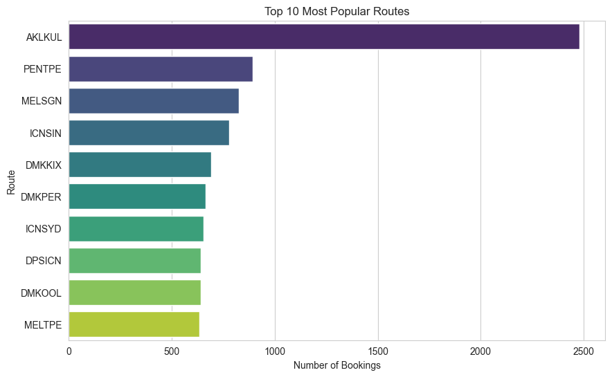
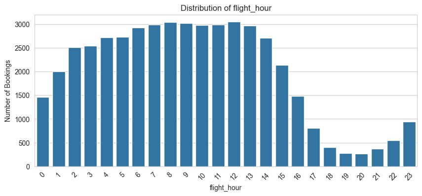

<h1 align="center">Data Engineering Report - Team 74</h1>

This report answers the Data Engineering (DE) questions.

---

## Q1 —  What are the top 10 most popular flight routes?

  
   
  <em>Figure 1. Top 10 routes by number of bookings.</em>

* We choose the routes present in the `passenger_booking_data.csv` dataset due to the fact that it had zero nulls and was clean.

---

## Q2 — What is the distribution of bookings across flight hours?

  
   
  <em>Figure 2. Bookings across flight hours (0–23).</em>

---

## Q3 —  By analyzing review patterns, which traveler type and class combination yields the highest and lowest ratings?

  
   
  <em>Figure 3. Average ratings by traveler type and class combination.</em>

* Solo Leisure travelers in First class yield the highest average ratings.
* Various traveler types in Economy class yield the lowest average ratings followed by Business class in Economy class.

---
