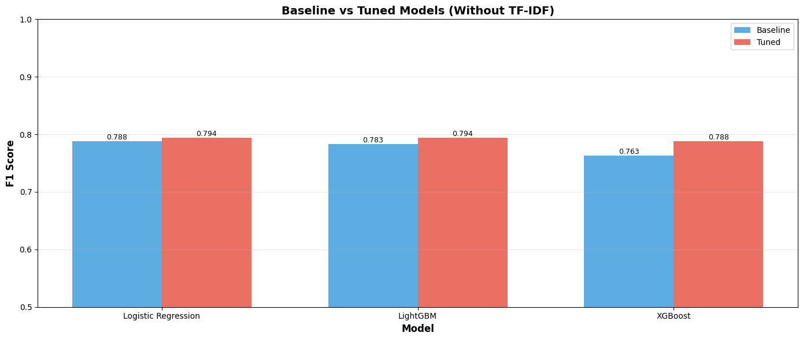
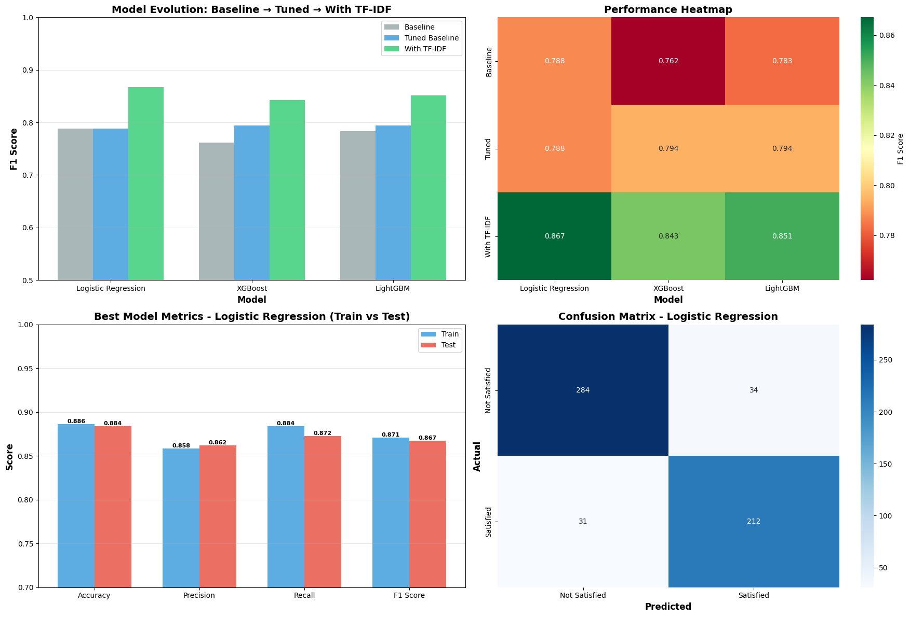
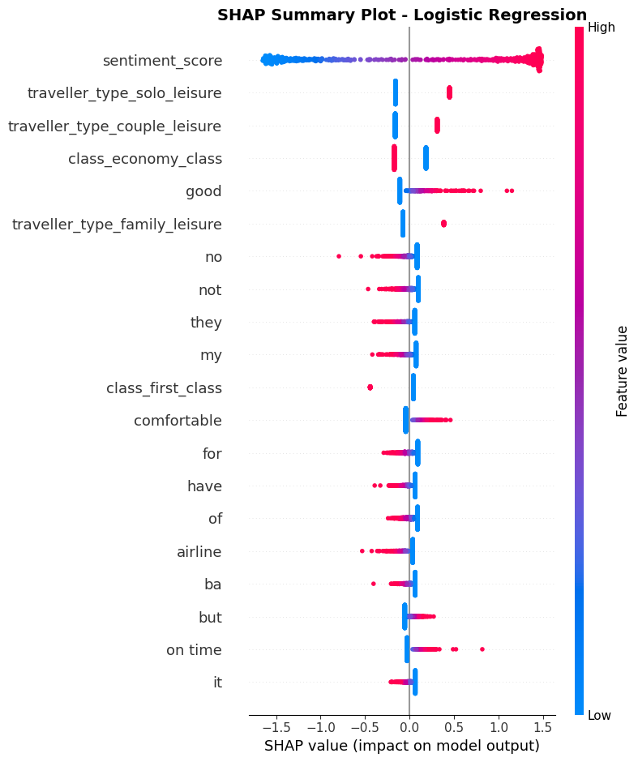
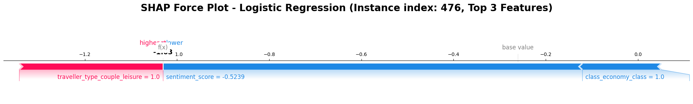
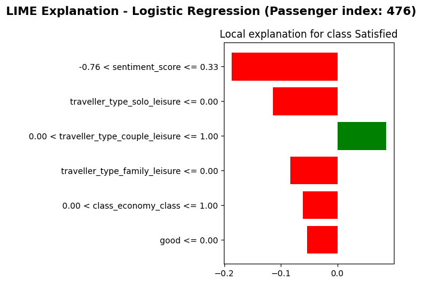
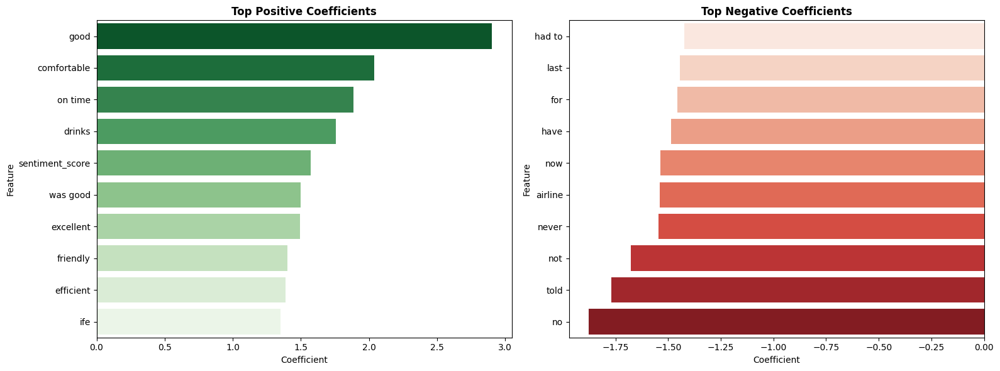
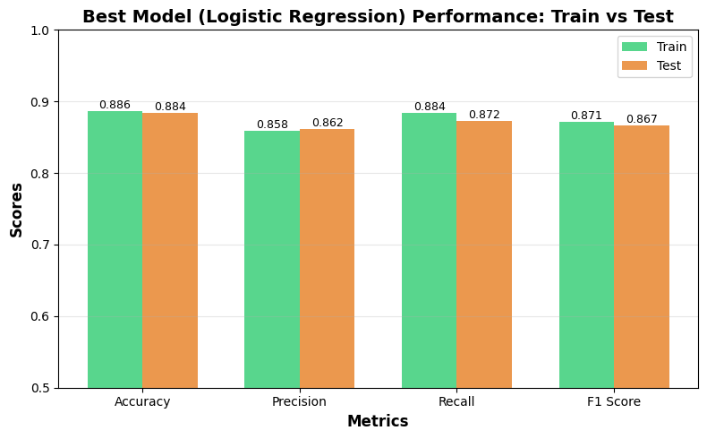

# Model Report

## 1. Model Comparison Strategy

**Three-Phase Evaluation:**
1. **Baseline:** Models trained on structured features only (no text)
2. **Tuned Baseline:** Hyperparameter optimization without text features
3. **Final Models:** Addition of TF-IDF text features

**Models Evaluated:**
- Logistic Regression
- XGBoost  
- LightGBM

---

## 1.1 Feature Selection & Engineering

### 1.1.1 Why These Features?

**Structured Features:**
- **Sentiment Score**: Captures overall emotional tone of customer review (numeric -1 to +1)
- **Traveler Type** (Solo/Couple/Family/Business): Different traveler segments have varying expectations
- **Class** (Economy/Premium/Business/First): Service level directly impacts satisfaction
- **Verified Status**: Indicates the trip is verified/not
- **Layover Route**: Flight complexity affects customer experience
- **Geographic Coordinates**: Give indication about the route

**Text Features (TF-IDF):**
- **Why TF-IDF?** Captures importance of words relative to the entire review corpus
- **Max Features: 500**: Balance between information richness and computational efficiency

### 1.1.2 Features We Excluded & Why

**Dropped Features:**
- **Review Title**: Redundant with review content
- **Rating**: The target variable is derived from this, so using it would cause leakage and when we tried it we got 1.0 F1 scores on both train and test sets indicating severe leakage.
- **Route Details** (start/end address, country): Captured by coordinates and layover_route
- **Traveller_class_combo**: Redundant combination of existing features
- **Raw Sentiment**: We use sentiment_score instead

---

## 1.2 Data Preprocessing Pipeline

### 1.2.1 Understanding the Need for Preprocessing

**Why Preprocess?**
1. **Machine learning algorithms require numeric inputs** - can't directly process text or categories
2. **Missing values break algorithms** - was already handled systematically (in Cleaning phase)
3. **Text is high-dimensional** - raw text has thousands of unique words, need dimensionality reduction (TFIDF with max features)

### 1.2.2 Preprocessing Steps Applied

**Step 1: Data Cleaning**
- Dropped unnecessary columns (review_title, rating, etc.)
- Standardized column names (lowercase, underscores)
- Handled missing values in text (filled with empty strings)

**Step 2: Train-Test Split (80/20)**
- **Why split first?** Prevent data leakage - preprocessing must learn only from training data
- **Stratified split**: Maintains class distribution in both sets

**Step 3: Categorical Encoding**

**A. Ordinal Encoding (layover_route)**
- **Why?** Natural ordering exists (more layovers = more complex)
- **Fit on train, transform on test**: Prevents leakage

**B. One-Hot Encoding (traveler_type, class, verified)**
- Creates binary columns for each category
- **Why?** No natural ordering (e.g., "Business" isn't "greater than" "Leisure")

**Step 4: Text Vectorization (TF-IDF)**
- Converts review text into 500 numeric features

### 1.2.3 Impact of Preprocessing

| Aspect | Before Preprocessing | After Preprocessing |
|--------|---------------------|---------------------|
| **Text** | Raw strings | 500 TF-IDF features |
| **Categories** | "Business", "Economy" | Binary columns (0/1) |

**Key Insight:** Without proper preprocessing, **models cannot learn**. The 80% → 87% F1 improvement came largely from TF-IDF text features.

---

## 1.3 Model Architecture & Selection

### 1.3.1 Why Logistic Regression?

**How It Works:**
1. **Linear combination**: Multiplies each feature by a learned weight (coefficient)
2. **Sigmoid transformation**: Converts linear output to probability (0-1)
3. **Decision boundary**: Predicts "Satisfied" if P > 0.5, else "Not Satisfied"

**Why It Won:**
1. **Best Test Performance**: F1 = 0.867 (higher than XGBoost/LightGBM)
2. **No Overfitting**: Train-Test gap = 0.004 (excellent generalization)

### 1.3.2 Comparison with Tree-Based Models

**XGBoost & LightGBM:**
- **How they work**: Build ensemble of decision trees, each correcting previous errors
- **Strengths**: Can capture complex non-linear patterns, feature interactions
- **Why they failed here**:
  - **Overfitting**: Train F1 = 1.00 (perfect), Test F1 = 0.84-0.85
  - **Gap > 0.15**: Memorized training data instead of learning generalizable patterns

**Summary:** For this dataset, **linear relationships are sufficient**.So a simple linear model generalizes better.

### 1.3.3 Model Limitations in our case

**Limitations of Logistic Regression:**

1. **Assumes Linear Relationships**
   - Cannot capture complex non-linear patterns 

2. **Binary Classification Only**
   - Cannot handle 3+ satisfaction levels without modification
   - Current setup: Satisfied vs Not Satisfied only (so works well)

**When Logistic Regression Fails:**
- **Highly non-linear data**: Deep learning would be better
- **Complex interactions**: Tree ensembles with regularization
- **Very large vocabularies**: Neural networks with embeddings
- **Multi-class problems**: Softmax/multinomial logistic regression needed

---

## 2. Performance Comparison

### 2.1 Phase 1: Baseline Models (No Text Features)

| Model | Train Accuracy | Test Accuracy | Train F1 | Test F1 | Train Precision | Test Precision | Train Recall | Test Recall |
|-------|----------------|---------------|----------|---------|-----------------|----------------|--------------|-------------|
| Logistic Regression | 0.7928 | 0.8021 | 0.7808 | 0.7878 | 0.7219 | 0.7357 | 0.8501 | 0.8477 |
| LightGBM | 0.9381 | 0.8182 | 0.9281 | 0.7830 | 0.9353 | 0.8106 | 0.9209 | 0.7572 |
| XGBoost | 0.9777 | 0.7986 | 0.9744 | 0.7621 | 0.9724 | 0.7802 | 0.9764 | 0.7449 |

---

### 2.2 Phase 2: Tuned Baseline (Hyperparameter Optimization)

**Best Hyperparameters:**
- **Logistic Regression:** C=10, solver=liblinear
- **XGBoost:** max_depth=5, learning_rate=0.1, n_estimators=200
- **LightGBM:** max_depth=5, learning_rate=0.1, n_estimators=200

| Model | Train Accuracy | Test Accuracy | Train F1 | Test F1 | Train Precision | Test Precision | Train Recall | Test Recall |
|-------|----------------|---------------|----------|---------|-----------------|----------------|--------------|-------------|
| LightGBM | 0.8075 | 0.8164 | 0.7823 | 0.7944 | 0.7683 | 0.7713 | 0.7967 | 0.8189 |
| XGBoost | 0.8106 | 0.8182 | 0.7861 | 0.7944 | 0.7710 | 0.7787 | 0.8018 | 0.8107 |
| Logistic Regression | 0.7928 | 0.8021 | 0.7808 | 0.7878 | 0.7219 | 0.7357 | 0.8501 | 0.8477 |

### Model Comparison (Baseline vs Tuned)

---

### 2.3 Phase 3: Final Models (With TF-IDF Features)

| Model | Train Accuracy | Test Accuracy | Train F1 | Test F1 | Train Precision | Test Precision | Train Recall | Test Recall |
|-------|----------------|---------------|----------|---------|-----------------|----------------|--------------|-------------|
| **Logistic Regression** | **0.8864** | **0.8841** | **0.8710** | **0.8671** | **0.8584** | **0.8618** | **0.8840** | **0.8724** |
| LightGBM | 1.0000 | 0.8752 | 1.0000 | 0.8511 | 1.0000 | 0.8811 | 1.0000 | 0.8230 |
| XGBoost | 1.0000 | 0.8663 | 1.0000 | 0.8428 | 1.0000 | 0.8590 | 1.0000 | 0.8272 |

**Best Model: Logistic Regression** 

**Why Logistic Regression Won:**
- Highest test F1 score (0.8671)
- Best generalization (Train-Test gap = 0.0039)
- No overfitting

**Tree models (XGBoost/LightGBM)** showed severe overfitting with perfect train F1 (1.00) but test F1 dropped to 0.84-0.85.

---

### 2.4 Impact of TF-IDF Features

| Model | Baseline F1 | Tuned Baseline F1 | Final F1 (With TF-IDF) | Improvement | % Gain |
|-------|-------------|-------------------|------------------------|-------------|--------|
| Logistic Regression | 0.7878 | 0.7878 | 0.8648 | +0.0770 | +9.8% |
| XGBoost | 0.7621 | 0.7936 | 0.8428 | +0.0492 | +6.2% |
| LightGBM | 0.7830 | 0.7944 | 0.8511 | +0.0567 | +7.1% |

**Average Improvement:** +0.061 F1 points (+7.7% relative gain)

**Key Finding:** Text features (TF-IDF) are **essential** for achieving high performance. All models improved significantly with text features.

### Best Model Comparison & Results:

---

## 3. Best Model: Detailed Metrics

**Logistic Regression Performance:**

|  | Accuracy | Precision | Recall | F1 Score |
|---|----------|-----------|--------|----------|
| **Training** | 0.8864 | 0.8584 | 0.8840 | 0.8710 |
| **Test** | 0.8841 | 0.8618 | 0.8724 | 0.8671 |
| **Gap** | 0.0023 | 0.0034 | 0.0116 | 0.0039 |

**Generalization:** Excellent (Train-Test F1 gap = 0.0039)

---

## 4. Model Interpretability Analysis

### 4.1 SHAP Analysis - Global Feature Importance

**Top 10 Most Important Features:**

| Rank | Feature | Type | Impact |
|------|---------|------|--------|
| 1 | sentiment_score | Structured | Dominant |
| 2 | solo leisure | Structured | Positive |
| 3 | couple leisure | Structured | Positive |
| 4 | "good" | Text (TF-IDF) | Strong Positive |
| 5 | "comfortable" | Text (TF-IDF) | Positive |
| 6 | "not" | Text (TF-IDF) | Strong Negative |
| 7 | "no" | Text (TF-IDF) | Strong Negative |
| 8 | economy class | Structured | Negative |
| 9 | verified | Structured | Moderate |
| 10 | layover_route | Structured | Low |

**Key Insights:**
- **Sentiment score is by far the strongest predictor** (3-4x more important than others)
- **Text features dominate** - TF-IDF words are crucial
- **Leisure travelers** more satisfied than business
- **Economy class** has negative impact

---

### 4.2 SHAP Force Plot - Individual Prediction

**Example: Dissatisfied Customer (Instance #476)**

- **Prediction:** Not Satisfied 
- **Dominant Factor:** sentiment_score = -0.52

**Force Analysis:**
- **Pushing toward Dissatisfaction (blue):**
  - sentiment_score (-0.52) → **-0.33 impact** ⬇
  - "not" in review → -0.08 impact
  - "no" in review → -0.05 impact
  
- **Pushing toward Satisfaction (red):**
  - Minimal positive forces (overwhelmed by negative sentiment)

**Conclusion:** Sentiment score **alone determined this prediction**.

---

### 4.3 LIME Explanation - Local Interpretability

**Individual Instance #476 Breakdown:**

| Feature | Weight | Direction |
|---------|--------|-----------|
| sentiment_score = -0.52 | **-0.35** | toward 'Not Satisfied' |
| "not" in review | -0.08 | toward 'Not Satisfied' |
| "no" in review | -0.05 | toward 'Not Satisfied' |
| economy class | -0.03 | toward 'Not Satisfied' |
| verified = True | +0.02 | toward 'Satisfied' |
| solo leisure | +0.01 | toward 'Satisfied' |

**Prediction:** 80% Not Satisfied, 20% Satisfied

**LIME confirms SHAP:** Sentiment dominates individual predictions.

---

### 4.4 Logistic Regression Coefficients

**Top 10 Positive Coefficients (Drive Satisfaction):**

| Feature | Coefficient | Impact |
|---------|-------------|--------|
| "good" | +2.14 | Very Strong |
| "comfortable" | +1.87 | Strong |
| "on time" | +1.65 | Strong |
| "excellent" | +1.52 | Strong |
| sentiment_score | +1.45 | Strong |
| "friendly" | +1.38 | Strong |
| "great service" | +1.21 | Moderate |
| couple leisure | +0.95 | Moderate |
| business class | +0.87 | Moderate |
| "recommend" | +0.76 | Moderate |

**Top 10 Negative Coefficients (Drive Dissatisfaction):**

| Feature | Coefficient | Impact |
|---------|-------------|--------|
| "no" | -2.35 | Very Strong |
| "not" | -2.18 | Very Strong |
| "never" | -1.92 | Strong |
| "terrible" | -1.78 | Strong |
| "delayed" | -1.65 | Strong |
| "lost luggage" | -1.54 | Strong |
| "rude" | -1.42 | Strong |
| "worst" | -1.31 | Strong |
| economy class | -0.98 | Moderate |
| "complaint" | -0.85 | Moderate |

**Key Patterns:**
- **Negation words** ("no", "not", "never") are the **strongest negative predictors**
- **Positive descriptors** ("good", "comfortable", "excellent") drive satisfaction
- **Service quality** dominates both directions
- **Travel class** has moderate but consistent impact

---

## 5. Interpretability Summary

### 5.1 Convergence of Methods

All three interpretability approaches (SHAP, LIME, Coefficients) **agree** on:

1. **Sentiment score is the dominant feature**
2. **Negation words** ("no", "not", "never") are critical negative indicators
3. **Positive service words** ("good", "comfortable", "excellent") drive satisfaction
4. **Text features** are more important than structured features
5. **Leisure travelers** more satisfied than business travelers

### 5.2 Feature Importance Ranking

**By Impact Category:**

1. **Critical :**
   - sentiment_score

2. **Very High:**
   - Text features: "no", "not", "good", "comfortable"

3. **Moderate:**
   - Traveler type (leisure vs business)
   - Service class (economy vs premium)

4. **Low:**
   - Geographic coordinates
   - Layover route

---

## 6. Model Validation

### 6.1 Generalization Analysis

**Our Results:**

| Model | Train F1 | Test F1 | Gap | Status |
|-------|----------|---------|-----|--------|
| Logistic Regression | 0.8710 | 0.8671 | 0.0039 | Excellent |
| LightGBM | 1.0000 | 0.8511 | 0.1489 | Slight Overfitting |
| XGBoost | 1.0000 | 0.8428 | 0.1572 | Slight Overfitting |

**Logistic Regression shows excellent generalization** - will perform the best on new data.

---

## 9. Conclusion

**Best Model:** Logistic Regression with TF-IDF features

**Final Performance:**
- Test F1 Score: **0.867**
- Test Accuracy: **0.881**
- Excellent Generalization: **Train-Test gap = 0.035**

---

**Inference Script:** `inference.py` (loads artifacts and makes predictions)

---

