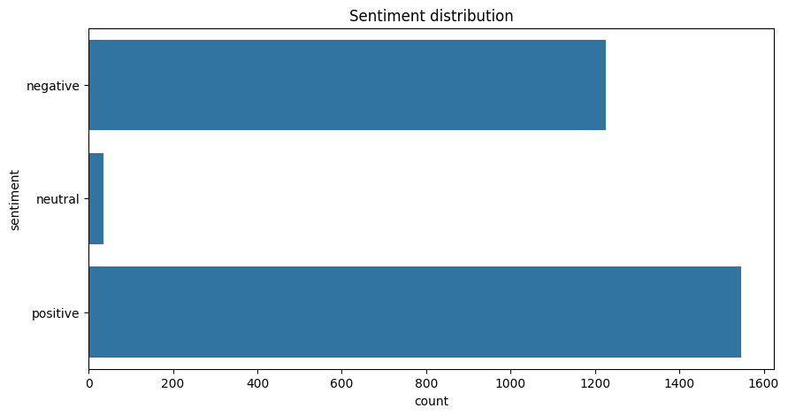
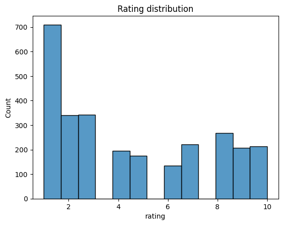
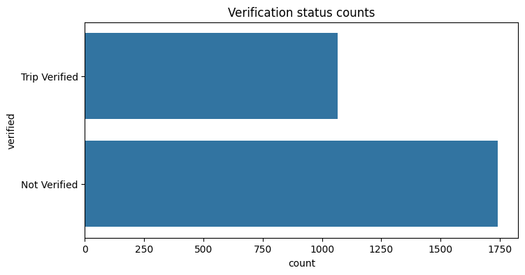
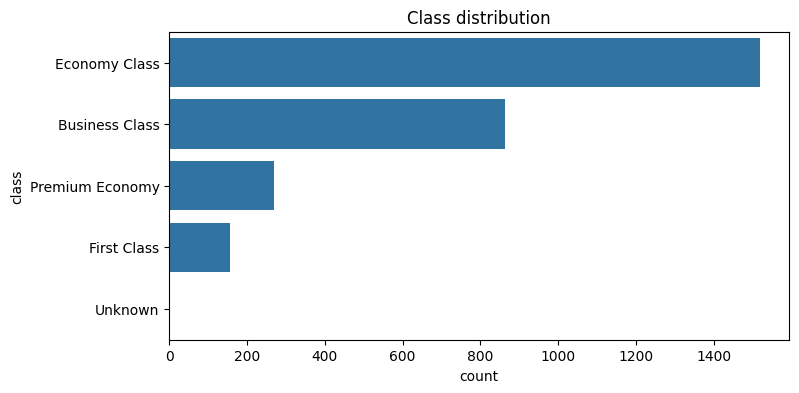
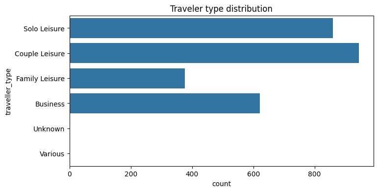
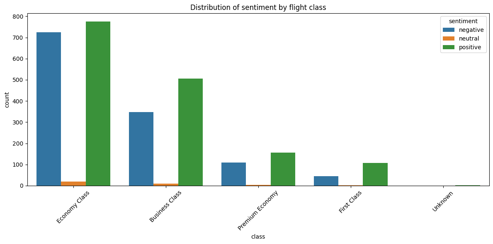
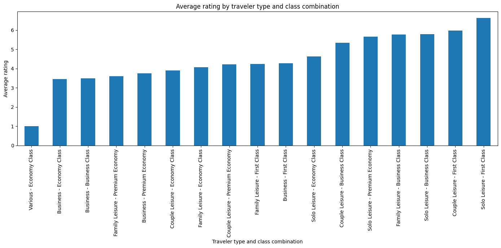
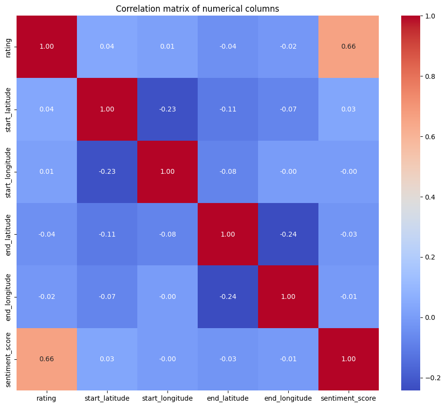

# Airline Review Cleaning & Analysis Report

## Overview

The notebook `AirlineScrappedReview_Cleaning_&_Analysis.ipynb` processes airline review data to deliver a clean dataset enriched with sentiment insights and exploratory findings. Workflows include data quality fixes, engineered features, visual analytics, and a final export that is ready for downstream modeling.

## Data Preparation Steps

- Normalized column names to snake case to remove spaces and inconsistent capitalization, ensuring easier downstream manipulation.
- Removed duplicates identified by `df.duplicated()` to guarantee unique review entries.

## Handling Missing and Inconsistent Data

- **Layover route**: Replaced missing values with `"direct_flight"`, aligning with the assumption that absent layover information implies nonstop itineraries.
- **Geospatial attributes** (`start_latitude`, `start_longitude`, `start_address`, `end_latitude`, `end_longitude`, `end_address`): Imputed values by borrowing the first known observation that shared the same `start_location` or `end_location`, preserving geographically consistent routes.
- **Traveler type**: Removed rows where `route` remained null after imputation, mitigating ambiguity between missing routing information and unknown traveler profiles.
- **Irrecoverable fields**: Dropped `passanger_name` (not useful analytically) and `flying_date` (excessive missingness beyond salvage).

## Sentiment Engineering

- Applied VADER sentiment analyzer on `review_content` to create:
  - `sentiment`: categorical label (positive, neutral, negative).
  - `sentiment_score`: compound polarity score used for nuanced interpretation.
- Introduced `is_satisfied`, flagging reviews with rating ≥ 5 to simplify satisfaction-based aggregations.

## Feature Enhancements

- Generated `start_country` and `end_country` by parsing the trailing segment of address strings, enabling geography-oriented aggregations.
- Constructed `traveller_class_combo` by concatenating traveler type and cabin class, revealing combined behavior patterns.

## Exploratory Analytics & Key Findings

- **Null Audits**: Post-imputation tallies confirmed all critical columns were filled or purposefully removed, reducing downstream data loss.
- **Outlier Scans**: Boxplots across numeric metrics highlighted variance but did not trigger removals; values retained to preserve authentic travel experiences.  Refer to `../figs/airline_review/boxplot_*.png` for the full set.
- **Sentiment Distribution**: Count plot showed a predominance of positive or negative reviews.  
- **Ratings Histogram**: Skewed distribution underscored concentration around lower star ratings, aligning with sentiment trends.  
- **Verification Status**: Majority of reviews were unverified, which makes us think if we should trust them.  
- **Cabin Class Mix**: Economy dominated review volume, indicating primary customer segment and potential service bottlenecks.  
- **Traveler Type**: Couples generated the highest volume of feedback, suggesting targeted service improvements for leisure duos.  
- **Top Destinations**: London (inclusive of Heathrow) surfaced repeatedly for both start and end locations, consistent with a British Airways-centric dataset and highlighting the need to deduplicate location aliases.  See `../figs/airline_review/top_end_locations_*.png` and `../figs/airline_review/top_start_locations_*.png` for traveler-specific breakdowns.
- **Sentiment by Class**: The distribution of sentiments in each class seems to be reletivly the same.  
- **Sentiment by Traveler Type**: Business travelers registered higher negative ratios, informing customer experience priorities.  
- **Ratings by Traveler-Class Combo**: Solo leisure travelers flying first class achieved the top average ratings, while the Various traveler segment in economy reported the lowest; both patterns align with expectations around cabin experience quality.  
- **Correlation Heatmap**: Weak correlations between numeric columns signaled limited linear relationships, prompting reliance on categorical aggregations rather than linear modeling.  

## Data Export

- Persisted the cleaned and enriched dataset to `AirlineScrappedReview_Cleaned_Enhanced.csv`, ensuring reproducibility and a ready-to-use artifact for modeling or dashboarding.

## Traveler Insights

- **Highest vs Lowest Ratings**: By inspecting `../figs/airline_review/avg_rating_by_traveler_class.png`, the solo leisure cohort traveling in first class records the highest average ratings, consistent with premium seating, service, and dining. In contrast, the Various traveler type when booked in economy yields the lowest ratings, reflecting the tighter cabin and mixed-purpose journeys typical of that group.
- **Understanding "Various"**: The dataset uses "Various" when reviews aggregate feedback across multiple passengers (for example, mixed business and leisure companions) or when the airline did not capture a single dominant traveler type. It effectively represents a miscellaneous category rather than a distinct demographic segment.
