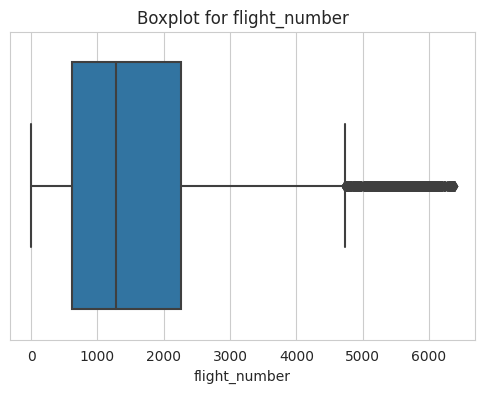
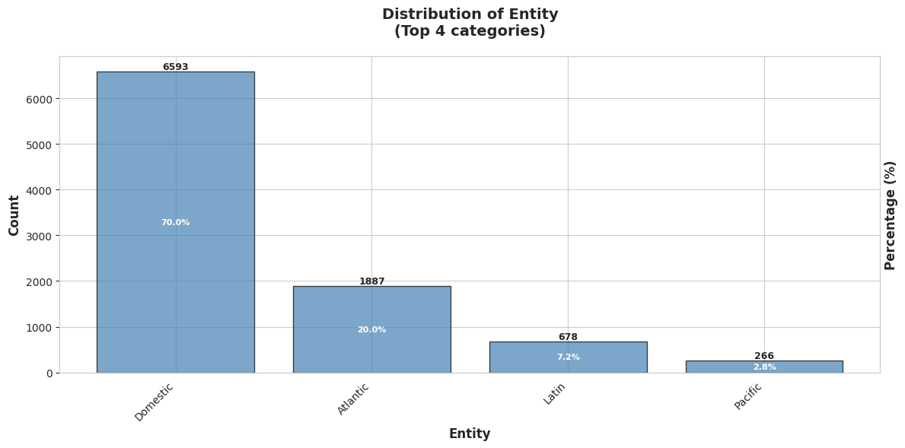
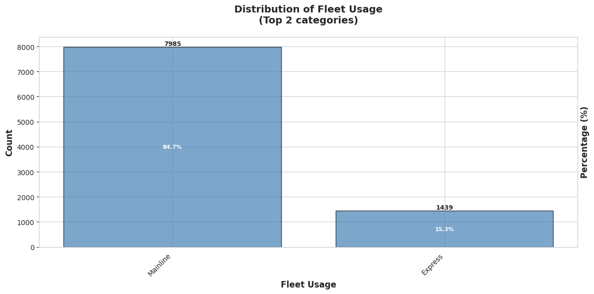
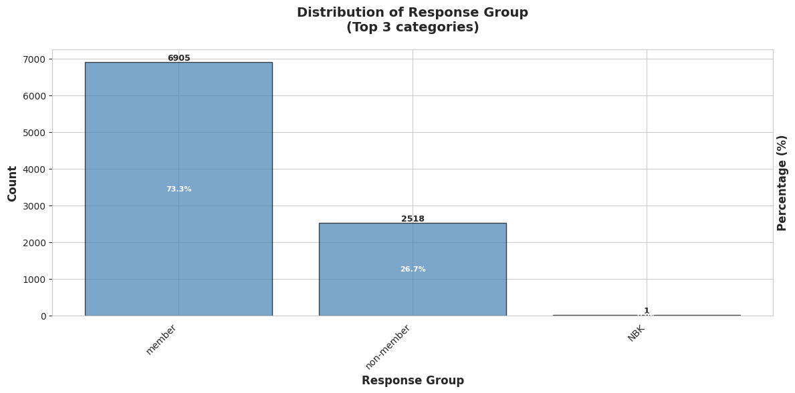
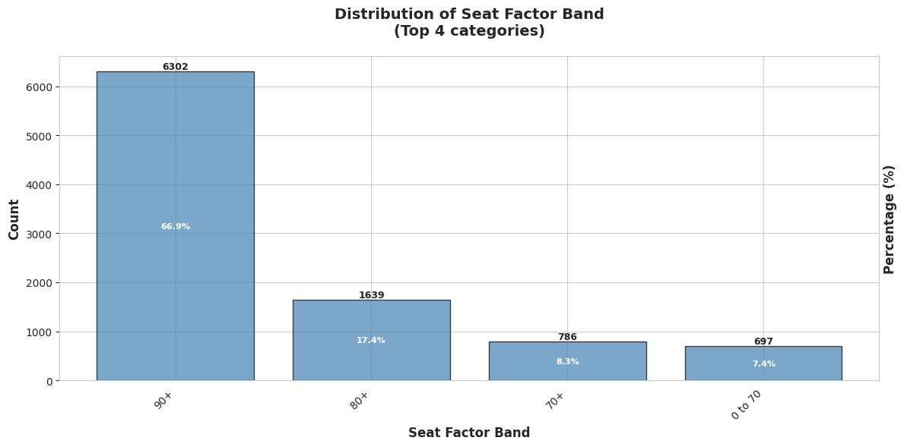
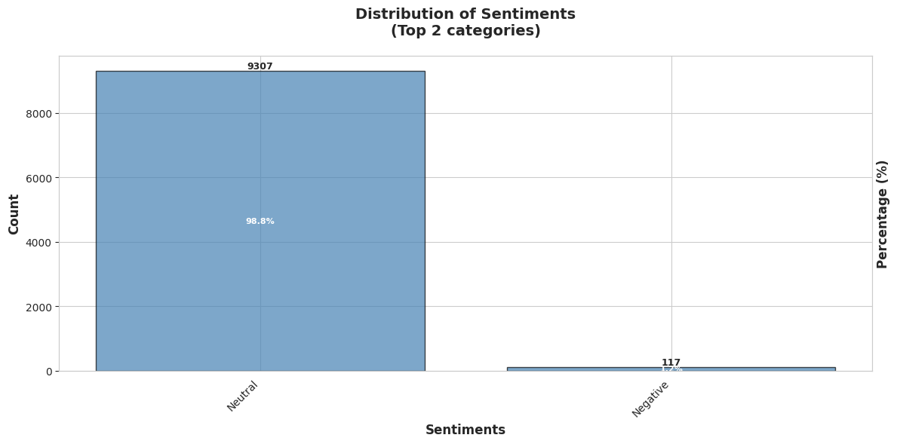
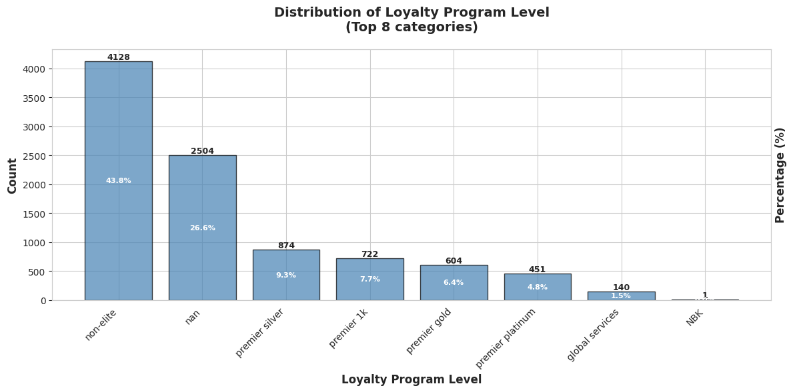
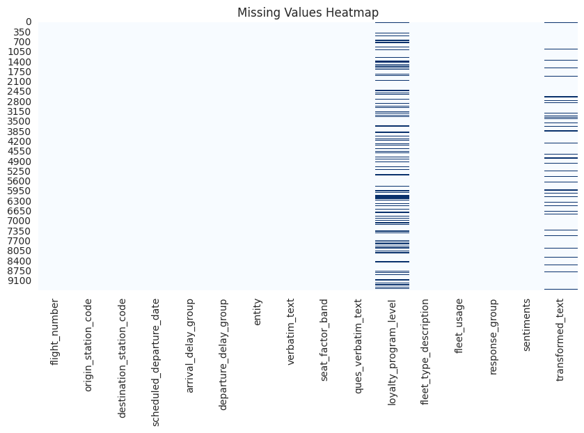
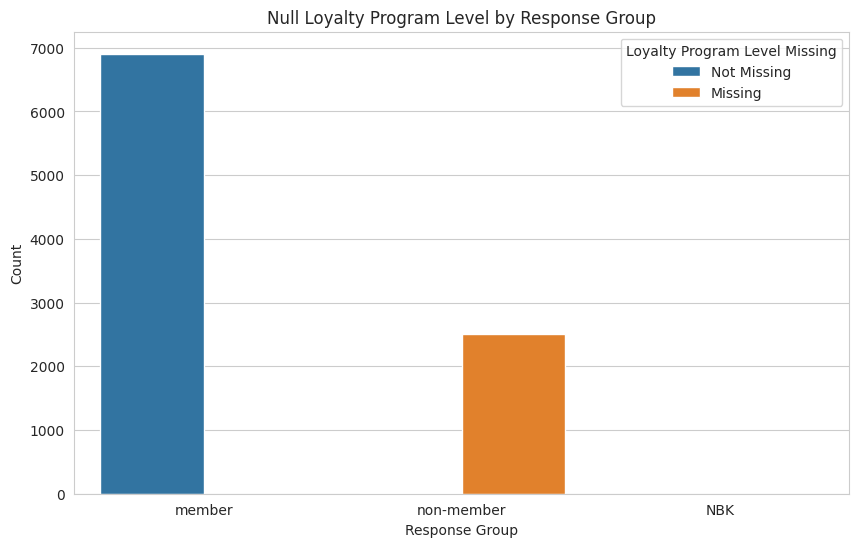

# Airline Customer Comment - Cleaning & Analysis Report

## Overview
Processed 9,424 customer comment entries from September 2022 focusing on food & beverage service quality across domestic and international flights.

## Data Quality Assessment

### Duplicates
- Found: 2 duplicate rows
- **Action**: Retained (different customers can provide identical feedback)

### Missing Values
- `loyalty_program_level`: 2,504 (26.6%)
- `transformed_text`: 1,019 (10.8%)
- All operational columns complete

### Outliers
- Flight numbers showed extreme values (~6000) but represent valid identifiers
- **Action**: No removal

### Key Categorical Distributions

**Entity (Flight Region)**:

- Domestic Mainline flights formed the largest share

**Fleet Usage**:

- Mainline fleet usage passengers dominated feedback volume.

**Response Group**:

- Members dominated feedback volume.

**Seat Factor Band** (occupancy):

- High seat occupancy (90%+) dominates the dataset.

**Sentiments**:

- Neutral sentiment overwhelmingly exceeds Negative, showing strong class imbalance.

**Loyalty Program**:

- Non-elite passengers dominated feedback volume.

## Data Cleaning

### Columns Dropped
1. `Unnamed: 0` - Redundant index
2. `ques_verbatim_text` - Single constant value (no variance)
3. `transformed_text` - Many missing values, contained meaningless text, and redundant with `verbatim_text`
4. `sentiments` - **Dropped after analysis** (see below)

### Missing Value Treatment
- **Loyalty Program Level**: Replaced `'NBK'` and `NaN` → `'non_member'`
- **Verbatim Text**: Standardized empty/useless responses → `'no_comment'`
  - Useless entries: `['no.', 'no', 'none.', 'n/a.', 'nothing.', '', ' ']`
  - Result: 774 placeholder responses identified
  

### Data Type Validation
- `scheduled_departure_date`: Validated as datetime-compatible 

### Category Filtering
- Removed 1 row where `response_group == 'NBK'`
- **Final dataset**: 9,423 records

## Statistical Relationship Analysis

Brief chi-square tests examined relationships between sentiment and operational features:

### Sentiment Relationship Analysis
1. **Fleet Usage vs Sentiments**: No significant relationship (p > 0.05)
2. **Response Group vs Sentiments**: No significant relationship (p > 0.05)
3. **Loyalty Program Level vs Sentiments**: No significant relationship (p > 0.05)
4. **Verbatim Text vs Sentiments**
Neutral Sentiment & "no_comment" Analysis
Chi-square: 14.548, p-value: 0.0001 (significant).
Despite significance, 88% of Neutral labels correspond to valid comments, indicating inconsistent sentiment labeling.

#### Decision: Sentiment Column Dropped
The `sentiments` column was **removed** because:
- **No positive class exists** - only Neutral (98.8%) and Negative (1.2%)
- **No statistical relationships** with any operational features
- **Broken labeling**: 88% of "Neutral" applied to customers with real feedback
- **Unusable for analysis**: Cannot distinguish satisfied vs dissatisfied customers

### Loyalty Program Level Missing Values Analysis
All missing values in `loyalty_program_level` corresponded to the non-member group and were replaced with "non_member".

## Final Dataset

**Saved as**: `cleaned_customer_feedback.csv`
- **Records**: 9,423
- **Features**: 13 (after encoding and drops)

## Key Insights

1. **Text data is primary asset**: 8,013 unique customer comments contain the real sentiment information
2. **High occupancy dominance**: 66.9% of flights had 90%+ seat factor
3. **Member engagement**: 73% of feedback from loyalty program members
4. **Departure delays more common**: 33.8% vs 27.7% arrival delays